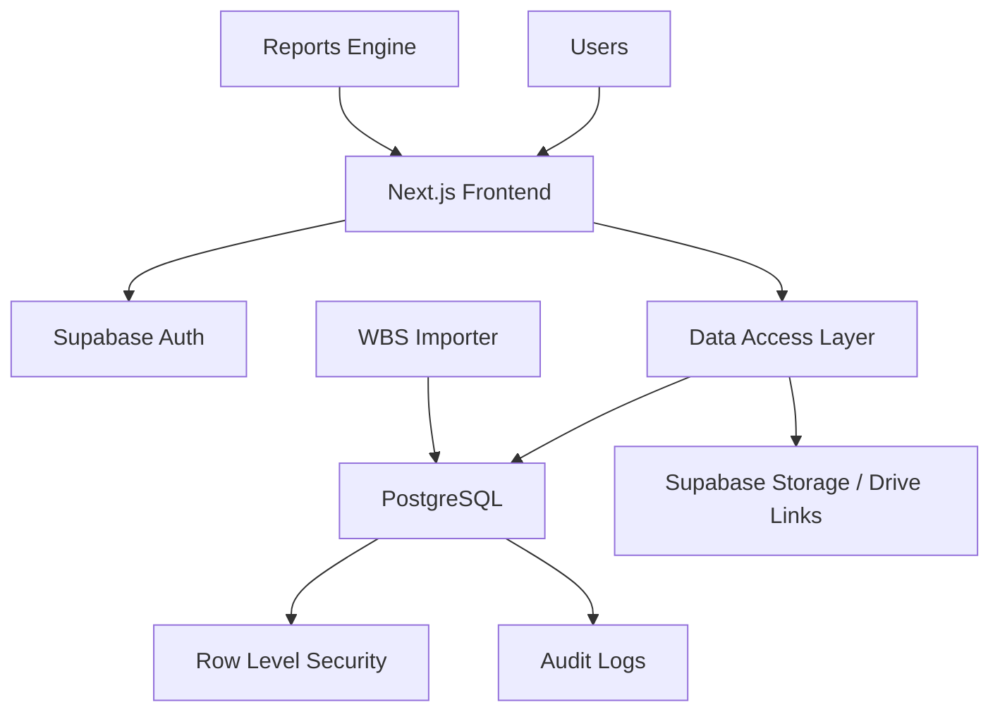

# KAG Command Center Technical Architecture

## الهدف

بناء منصة ويب حقيقية لإدارة المشروع مع الحفاظ على ملف HTML الحالي كمرجع تصميمي ونموذج عرض. التطبيق الجديد يجب أن يدعم البيانات الحية، المستخدمين، الصلاحيات، التحديثات اليومية، وسجل التغييرات.

## القرار التقني للمرحلة الأولى

### Frontend

Next.js مع TypeScript.

الأسباب:
- routing واضح.
- مناسب للداشبوردات.
- يعمل جيداً مع Vercel.
- يسهل فصل الصفحات والتبويبات.
- يدعم server actions أو API routes عند الحاجة.

### Backend / Data Layer

Supabase.

الأسباب:
- PostgreSQL جاهز.
- Auth جاهز.
- Row Level Security.
- Realtime لاحقاً.
- Storage إذا احتجنا مرفقات.
- أسرع طريق لبناء MVP حقيقي.

### Database

PostgreSQL.

الأسباب:
- علاقات قوية بين المهام والمخاطر والقرارات.
- audit logs قابلة للتدقيق.
- JSONB مفيد لتخزين before/after في السجلات.
- قابل للتوسع لاحقاً.

### Hosting

Vercel للواجهة.

الأسباب:
- نشر سريع.
- preview deployments.
- مناسب مع Next.js.

### Auth

Supabase Auth في البداية، مع Google Workspace SSO عند تفعيل الاستخدام الحقيقي.

### Charts

ECharts.

الأسباب:
- قوي للداشبوردات.
- يدعم RTL بصرياً بشكل مقبول.
- أفضل من Chart.js عندما تتوسع التحليلات.

### Timeline / Gantt

vis-timeline كبداية. إذا احتجنا إدارة Gantt احترافية لاحقاً:
- DHTMLX Gantt
- Bryntum Gantt

## البنية العامة



## طبقات التطبيق

### 1. Presentation Layer

المسؤولية:
- صفحات النظام.
- التبويبات.
- الجداول.
- الرسوم.
- نماذج التحديث.

المجلدات المقترحة:

```text
app/
  dashboard/
  daily-updates/
  tasks/
  timeline/
  risks/
  decisions/
  approvals/
  reports/
  settings/
components/
  layout/
  charts/
  tables/
  forms/
  status/
```

### 2. Domain Layer

المسؤولية:
- حساب حالة المهام.
- حساب التأخير.
- حساب جودة البيانات.
- حساب مؤشرات القيادة.
- ربط المخاطر والقرارات بالمهام.

المجلدات المقترحة:

```text
lib/domain/
  task-status.ts
  schedule-health.ts
  data-quality.ts
  executive-metrics.ts
  risk-severity.ts
```

### 3. Data Layer

المسؤولية:
- Supabase client.
- queries.
- mutations.
- import/export.

المجلدات المقترحة:

```text
lib/data/
  supabase.ts
  tasks.ts
  task-updates.ts
  risks.ts
  decisions.ts
  approvals.ts
  audit.ts
```

### 4. Governance Layer

المسؤولية:
- صلاحيات.
- audit log.
- validation.
- approval workflow.

المجلدات المقترحة:

```text
lib/governance/
  permissions.ts
  audit-log.ts
  workflow.ts
```

## الصفحات في MVP

### Dashboard

مؤشرات تنفيذية:
- إجمالي المهام.
- نسبة الإنجاز.
- المهام المتأخرة.
- المهام دون تحديث.
- المخاطر الحرجة.
- القرارات المعلقة.

### Tasks

إدارة المهام:
- عرض WBS.
- فلاتر.
- تفاصيل المهمة.
- سجل تحديثات المهمة.

### Daily Updates

مركز تشغيل:
- مهامي.
- تحديث الحالة.
- عائق.
- إجراء قادم.

### Risks

سجل مخاطر أولي:
- إضافة خطر.
- تحديث المعالجة.
- ربط بمهمة.

### Decisions

قرارات وتصعيد:
- قرار جديد.
- حالة القرار.
- موعد الاستحقاق.

### Audit Log

سجل التغييرات:
- من غير ماذا.
- قبل/بعد.
- وقت التعديل.

## استراتيجية البيانات

### في البداية

نستورد WBS من الملف الحالي أو Google Sheet إلى قاعدة البيانات.

### بعد الاستيراد

قاعدة البيانات تصبح مصدر الحقيقة.

### Google Sheet

يبقى كأداة:
- import.
- export.
- مراجعة خارجية مؤقتة.

ولا يكون المصدر التشغيلي الدائم.

## قواعد حالة المهمة

### progress_status

القيم:
- not_started
- in_progress
- completed
- blocked
- cancelled

### schedule_status

القيم:
- on_track
- due_soon
- overdue
- critical
- no_dates

### قاعدة مهمة

لا تعتبر المهمة مكتملة لمجرد انتهاء تاريخها. الاكتمال يحتاج:
- progress_status = completed
- أو actual_finish موجود.

## Audit Log

كل تعديل على الجداول التالية يجب أن يكتب في audit_logs:
- tasks
- task_updates
- risks
- decisions
- approvals
- change_requests

الحقول المهمة:
- actor_id
- entity_type
- entity_id
- action
- before_json
- after_json
- reason
- created_at

## الصلاحيات الأولية

### Executive

قراءة dashboard والتقارير فقط.

### Project Manager

إدارة المهام، المخاطر، القرارات، الاعتمادات.

### PMO

إدارة WBS وجودة البيانات والتقارير.

### Workstream Owner

تحديث المهام المسندة له فقط.

### Viewer

قراءة فقط.

## Row Level Security

في Supabase يجب تفعيل RLS على الجداول الحساسة:
- profiles
- projects
- tasks
- task_updates
- risks
- decisions
- approvals
- audit_logs

في MVP يمكن البدء بسياسات مبسطة:
- authenticated users can read project data.
- owners can update assigned tasks.
- PM/PMO can update all project records.
- audit_logs read only for PM/PMO/Project Director.

## استيراد WBS

الاستيراد يجب أن يمر بمراحل:

1. Upload أو paste data.
2. Mapping للأعمدة.
3. Preview.
4. Validation.
5. Import.
6. Audit entry.

القواعد:
- كل task يأخذ id داخلي.
- wbs_code يبقى مرجعاً لا primary key.
- لا يسمح بتكرار wbs_code داخل نفس المشروع.

## تقارير المرحلة الأولى

ليست PDF كاملة في البداية. نبدأ بـ:
- dashboard metrics.
- export CSV.
- report-ready screen.

PDF يأتي في مرحلة لاحقة.

## علاقة ملف HTML الحالي بالتطبيق الجديد

ملف `KAG_Dashboard_Final.html` يبقى:
- مرجع تصميم.
- مصدر أولي لاستخراج WBS.
- نسخة عرض داخلية.

ملف `KAG_Dashboard_GitHub_Safe.html` يبقى:
- نسخة آمنة للعرض العام.

التطبيق الجديد لا يجب أن يعتمد على منطق HTML القديم مباشرة، بل يعيد بناء المنطق في TypeScript داخل `lib/domain`.

## مخاطر تقنية

### الاعتماد الزائد على Google Sheet

المعالجة:
استخدامه للاستيراد فقط.

### تضخم النطاق

المعالجة:
MVP واضح: Tasks + Daily Updates + Audit Log + Basic Dashboard.

### الصلاحيات المعقدة مبكراً

المعالجة:
RBAC بسيط أولاً، ثم تفصيل حسب المسار.

### ضعف جودة البيانات

المعالجة:
Data Quality Score من أول نسخة.

## قرار المرحلة الأولى

المرحلة الأولى تكتمل عندما تتوفر:

- وثيقة المعمارية.
- schema.sql.
- MVP scope.
- خطة مراحل واضحة.

بعدها يبدأ البناء الفعلي للتطبيق.

